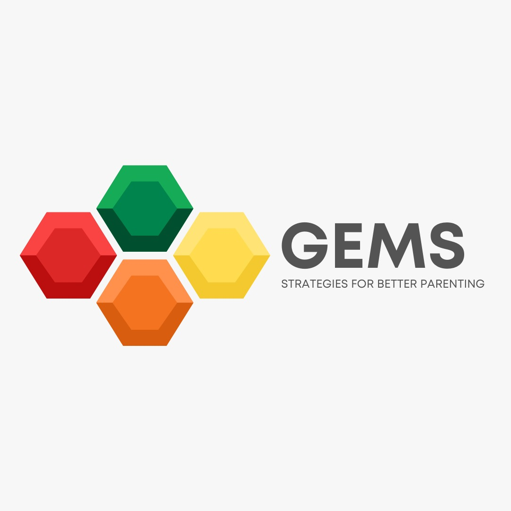
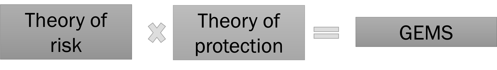
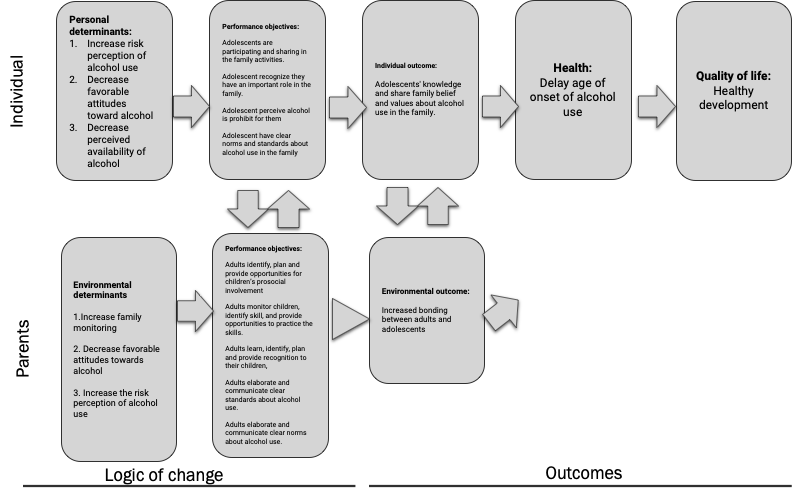
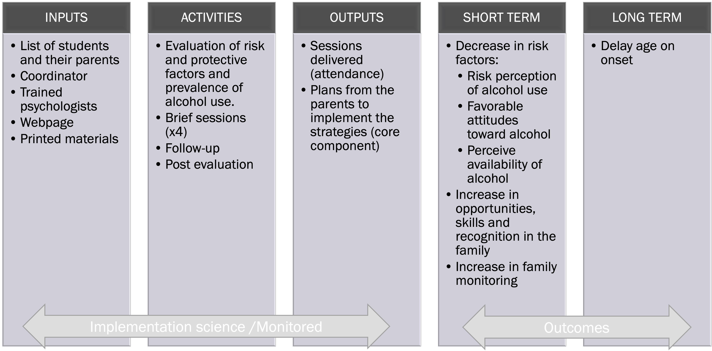
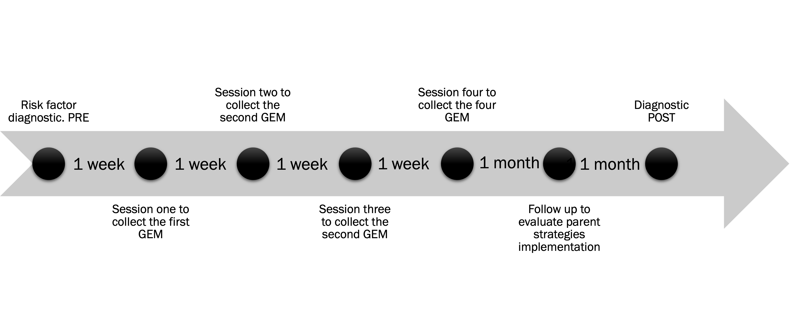
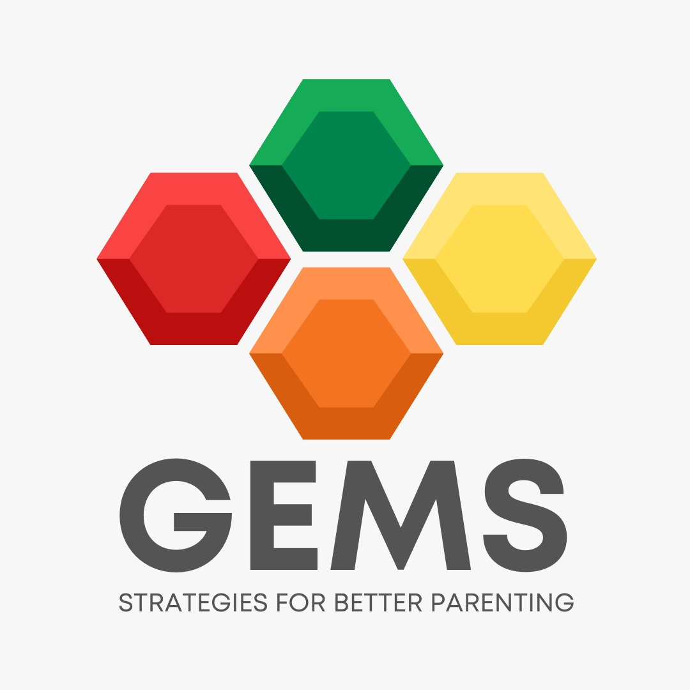
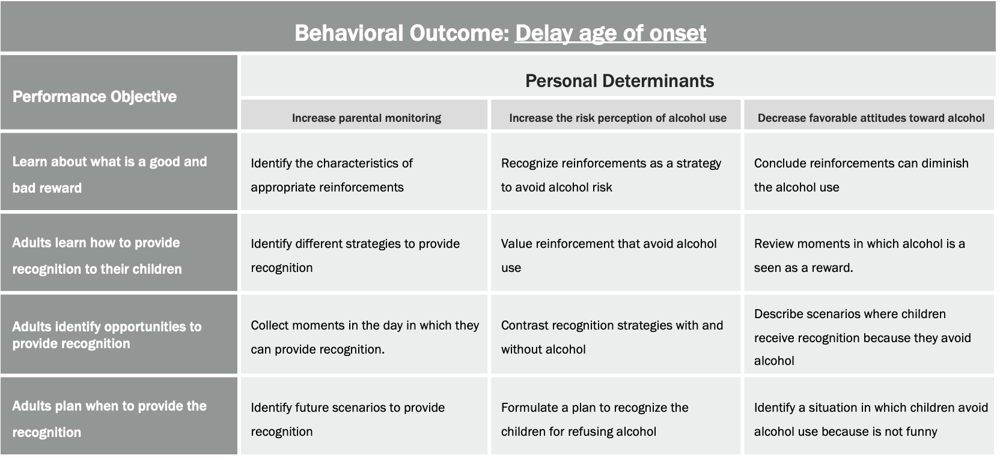

\newpage

# Overview

This document is the manual of the intervention *GEMS, strategies for better parenting*. Here, you will find a description of the rationale and theory that supports this intervention, the activities for the modules (recognition), and the instructions to the implementation team. GEMS was developed using the intervention mapping methodology [@Maping2016] to reduce one of the biggest problems that affect adolescents nowadays: early initiation of alcohol use.

GEMS is a self-guided intervention delivered via e-health/technology, supported by an implementation team of three trained professionals. The team is conformed by a coordinator in charge of recruitment and organizing the implementation. A psychologist to assists the parents and provides feedback on the program activities. Finally, a data scientist in charge of conducting the quantitative evaluations monitor the implementation and resolves technical issues during the program's implementation. 

Although this intervention is not the result of an adaptation process, it is based on essential theories in the prevention science field. Therefore, it shares some of its components with other programs to reduce substance use. The theories used to build the program are the Risk Factors Model and the Social Development Model. Similar components of this intervention can be found in interventions like AHORA, Tomando Buenas Decisiones, and Guiding Good Choices. All these interventions promote a healthy young development by working with  parents.  

\newpage

# Implemenetation Team Manual 

## What is GEMS?

GEMS is a prevention program that provides strategies to parents with children between 8 - 12 years to avoid alcohol use in adolescents. 

## Which are the four GEMS for better parenting?
### GEM 1 Opportunities 

The parents who earn this GEM can provide opportunities to children to participate in family activities and decisions. Children actively participating in significant family moments are more prone to follow the family belief about healthy behaviors. 

### GEM 2 Skills

The parents who earn this GEM can identify children's skills for healthy development. Children developing abilities have more opportunities to participate and obtain recognition. High-skilled children are more prone to share family values and follow the parent's expectations regarding healthy behaviors. 

### GEM 3 Recognition 

The parents who earn this GEM understand and implement recognition systems in everyday family activities. Therefore, children recognized by their parents know that they belong to the family and behave according to their parents' beliefs and values. 

### GEM 4 Clear Norms and Standards 

The parents who earn this GEM can communicate the expectation about risky behaviors like alcohol use and explain why alcohol is dangerous for young people. Adolescents with explicit norms and standards make more healthy decisions in risky situations. 

Parents can obtain the four GEMS and combine them to contribute to the healthy development of their children. 

*Children with opportunities to perform their skills are recognized!. Combining the GEMS is crucial to increase bonding between parents and children. A family with high levels of bonding is a family that shares values and follows everyone's expectations. That means healthy family behaviors.

## Why GEMS?

Parenting is challenging! But there is help. GEMS proposes that a family that shares healthy behavior beliefs and bonds can avoid risky behaviors in everyday life. These parenting skills will let you build bonding and share family values and beliefs. 

\newpage

# Rationale

## Epidemiological data about alcohol use

Alcohol is the drug most used by adults and adolescents around the world. Worldwide, 2.3 billion people currently drink alcohol. Adding all alcohol produced globally, the amount of pure alcohol consumed per person is around 6.4 liters, and people drink 32.8 grams of alcohol per day. Regarding adolescents, more than a quarter worldwide are current drinkers, which means that there are approximately 155 million adolescents using alcohol [@who2019].

Alcohol consumption affects health through the amount of alcohol consumption and through heavy drinking episodes. Volume alcohol consumption is mainly related to cancer, alcohol use disorder, liver disease, while severe drinking episodes are related to ischaemic illness, injuries, and harm to others [@rehm2017]. In adolescents, alcohol has been linked to proximal and distal adverse consequences. At this stage of development, alcohol intake is associated with structural and functional changes in the brain, such as impaired basal ganglia and prefrontal cortex development [@Kroll2020]. Also, it has been associated with negative social behaviors like episodes of verbal aggression, academic difficulties, loss of employment, and unintentional injury [@brown2008; @Meda2018; @Michael2015]. Given this evidence, the prevention of alcohol is crucial. 

## Why is it essential to prevent alcohol use in adolescents

Alcohol consumption disproportionately affects the young. The effects of alcohol use are in neurological and physiological development. Previous studies show that an early alcohol initiation is associated with an increased likelihood of developing alcohol dependency [@DeWit2000; @Guttmannova2011]. For instance, adolescents who start consuming alcohol before 11 to 14 years old have four times more chances of developing dependence than 19-year-old [@DeWit2000], highlighting the harm caused by alcohol in this vulnerable development period.

## How do GEMS prevent alcohol use in adolescents?

GEMS uses two different theories to address alcohol use in adolescents. One theory is related to risk. The other is related to protection. Combining these two theories provides a strong range of possibilities to reduce alcohol use in adolescents. 

### Theories of risk 

The standard approach to understanding alcohol use in youth is to analyze risk and protective factors [@Haggerty2013]. A risk factor is defined as characteristics from the individual, environment, or social context that increase the probability of using alcohol [@Sloboda2012]. According to this framework, individuals may be influenced by biological characteristics that increase the likelihood of developing a substance use disorder. Furthermore, these characteristics interact with the different levels defined by the ecological model [@Bronfenbrenner1998], which can be defined as a community, school, family, peer-individual and intra-individual. 

### What are the most common risk factors in each level of the ecological model?

#### Community

The community risk factors are categorized at the macrosystem level. Previous research highlights that *low community attachment* [@Patrick2013], *community disorganization* [@van2007], *laws and norms favorable to alcohol use* [@Orr2019] and the *perceived availability of drugs* [@Komro2007] increase alcohol consumption in adolescents.  

#### School

Research assessing the school domain suggests that *academic failure* [@Hemphill2014] and  *low commitment to school* [@Wormington2016] are associated with youth alcohol use. 

#### Family

The family level appears as one factor that affects youth alcohol use and other problematic behaviors like delinquency, teen pregnancy, school dropout, and violence. At this level, there is evidence that shows how *poor family management* [@Ewing2014], *family conflict* [@Just2018], *family history of antisocial behaviors* and *favorable parental attitudes to alcohol* [@Oesterle2012] predicts multiple problematic adolescent behaviors. 

#### Peer-individual

At the individual level,  *early initiation of alcohol use* is a widely established risk factor. Additionally, psychological theories demonstrate some other risk factors. For instance, *favorable attitudes to alcohol use* and \ *interaction with friends involved in problem behavior* are considered in the theory of reasoned action [@Ajzen2011] and the social learning theory [@Bandura1977]. Finally, from the health belief model, risk perception is one of the most relevant individual risk factors considered when preventing alcohol use [@Becker1974]. 

#### Intra-individual 

At this level, the exposition to alcohol during pregnancy has been associated with Fetal Alcohol Spectrum Disorders. This disorder causes low weight and height and abnormal central nervous system development [@Esper2014]. Finally, Regarding neurological effects, research has established that alcohol consumption is related to alterations in the dopaminergic response and downregulated capacity for top-down self-regulation [@Volkow2017].

### Theories of protection 

A protective factor is defined as characteristics from the individual, environment, or social context that decrease the probability of using alcohol [@Sloboda2012]. As well as risk factors, protective factors are in different domains. However, they all have two characteristics in common: they are built on the everyday interaction between the child and their environment and look for increasing bonding between the child and significant groups (parents, schools, peers).

The protective factors are organized in the Social Development Model (@Catalano2020). According to this model, positive behavior results from the following elements: (1) perception of opportunities for prosocial involvement, (2) involvement with others who practice prosocial behaviors, (3)  increase on skills for social and emotional life, and increase in cognitive skills and (4) increase on the perception of rewards for prosocial behavior and interactions. 

GEMS combines all these different elements in one single theory of action! 

## Theory of change of GEMS

The theory of change of GEMS is simple. Let's start with the goal, which is to achieve healthy development. As mentioned before, alcohol use during adolescence negatively impacts growth, so the outcome of GEMS is to delay the age of onset of alcohol use. But, if we want to postpone the age of onset, it is essential to reach more general outcomes before. First, we need to involve and make the adolescents believe in the family values and follow the family rules regarding alcohol use. However, how can we do that? The GEM theory states that bonding is the bridge to compromise adolescents to follow family expectations. But, How can we create bonding? GEMS says parents should practice the four GEMS to better parenting: creating opportunities, cultivating skills, providing recognition, and communicating explicit norms and standards regarding alcohol use in the family. The combination of these strategies will increase bonding. Therefore, the adolescents will be more able to follow the standards and delay alcohol use initiation. Though, what needs parents to do differently to practice the GEMS? According to GEMS theory, there are three aspects that parents should change to start behaving toward a more positive young development. The first thing is to increase the family monitoring techniques. The second is to decrease the favorable attitudes towards alcohol use, and finally, the third is to increase the perception of the risk of alcohol use. 

It is how GEMS works.

## Summary

1. Change behavior determinants in parents: increase family monitoring, risk perception of alcohol use while decreasing favorable attitudes toward alcohol.
2. Increase  opportunities, skills, and recognition in the family daily routine.
3. Boost bonding using the GEMS
4. Communicate clear standards and rules regarding alcohol.
5. Delay the age of onset of alcohol use
6. Enjoy the healthy development of adolescents. 

# GEMS implementation

## How do GEMS operate?

The following figure explains the general components of the implementation of GEMS. 

To deliver GEMS, you should have a list of students and their parents. This is the GEMS program's requirement to schools or communities to participate in the program. Also, you are required to complete training (details in the next section). Finally, it would help if you had the web page working and some copies of the web page printed. 

The delivery of GEMS starts with implementing a diagnostic of risk and protective factors. The instrument used for this is the Communities that Care Youth Survey [@JohnBriney2012]. This instrument evaluates all the risk and protective factors addressed by GEMS. Once the students have answered the questionnaire, they are classified into three different levels of risk (low-moderate-high. Cut points will be developed in an independent study). These levels of risk will be essential to adapt the delivery method of the intervention (see adaptive component section). One month after parents earn the four GEMS, the facilitators will ask the parents to fill a follow-up survey in order to evaluate the intervention goals. Finally, two months after the intervention has finished, the student will complete the diagnostic again. 

## Short outcomes measure in GEMS?

The short outcomes of GEMS are measured in the student's diagnostic. The instrument evaluates the risk perception of alcohol use, favorable attitudes toward alcohol, and perceived availability of alcohol. In addition, parents will fill a follow-up survey to assess the level of implementation of parenting strategies to create opportunities, skills, and recognition. Finally, the diagnostic will ask for alcohol use in lifetime, 12 last months, and last month. 

## How much time it takes to earn the four GEMS?

Parents can obtain the four GEMS in 4 weeks (one week between each session). To unlock each GEM of better parenting, they have to complete all the self-directed activities on the web page. These activities will not take  more than 15 minutes each. After they finish the worksheets, they must implement and practice the skills they learned. 

## Adaptive component of GEMS. 

GEMS is an intervention that adapts the delivery method according to preexisting levels of risk. The following figure describes the adaptive process.  

The students will be classified into three different levels of risk (low-moderate-high) based on their responses to the risk and protective factors survey. After they finish the survey, they will receive instant feedback with educational information about the risk associated with alcohol use. This information will be the same for all the students. However, based on the student's risk levels, the parents will receive the invitation to participate in the program through two different methods. Low and medium-risk groups only will receive the invitation to participate in GEMS via the web, while the high group risk will receive the invitation through mail and web. Parents who accept participation in GEMS from the high-risk group will receive the printed version of the intervention and the web format of the intervention. 

# Implementation team of GEMS

Implementing GEMS required a team conform for these three professionals. 

1. Coordinator
1. Facilitator
1. Data scientist

All members of the team are required to complete the GEMS training. The training has two components. The first is the presentation and discussion of the theories of the program. The second is about how the program operates. The training length is 8 hours, delivered in two days. In addition, the data scientist will require additional training in data management and testing.  

## Coordinator

The coordinator is a professional with experience in project management and abilities to organize and communicate with schools and communities. The responsibilities of the coordinator are:

* Schools and community recruitment. 
* Promote the school's engagement to implement the program. 
* Organize weekly meetings with the implementation team to coordinate activities. 
* Manage the relationships between the GEMS and the schools and communities. 

## Facilitator

The facilitator is a psychologist. Previous experience working on preventive programs is not required. The responsibilities of the psychologist are:

* Provide help to the participants to complete the sessions (online)
* Review the assignments and provide feedback to the participants (online)
* Develop content to update the web page and the online community
* Motivate participation in the online community of GEMS.
* Deliver the materials to high-risk participants.

## Data scientist

The data scientist is an engineer, statistician, or social scientist with experience in the administration of web pages. Experience in the administration of databases is required. The responsibilities of the data scientist are:

* Provide technical assistant to the participants (online)
* Evaluate the results of the diagnostics.
* Estimate the levels of risk.
* Adjust weekly reports of the implementation of the program
* Support the coordinator and the psychologist

\newpage

# GEMS participant manual

\newpage
# GEM3: Recognition 
## Objectives  
### General objetive 

Develop a plan to provide recognition to the child. 

### Specific objetives

### Behavioral change techniques

* Elaboration 
* Feedback
* Framing
* Goal setting
* Modeling

## What is recognition?

*RECOGNITION* is the ability to say: *you are important to me* 

Providing appropriate recognition to children facilitates positive development and avoids risky behaviors such as alcohol use.

RECOGNITION creates

* Bonding
* Happiness
* Love

Rewards can improve your relationship with your child and allow you to share your values and beliefs about healthy behaviors. 

An appropriate reinforcement has these characteristics: 

1. The reinforcement has to be *attractive* and valued by the child.
2. Happens *immediately* after a good or desired behavior. 
3. It is delivered *constantly* after the behavior happens.

Keywords: attractive, immediately, constantly. 
 
## How to provide recognition?

Most of the time, providing recognition is *free*. A gesture or a phrase can create an environment of love in the family. A good reward can be delivered as affection, praise, or attention.

Here are some examples of how to provide recognition:  

| Situation                                                                               | Answer                                                  | Immediate consequences                                                                                                              | Long-term consequence                                                                          |
| --------------------------------------------------------------------------------------- | ------------------------------------------------------- | ----------------------------------------------------------------------------------------------------------------------------------- | ---------------------------------------------------------------------------------------------- |
| You are in a family gathering and someone offers a sip of alcohol to your child         | The child refuses to try the drink                      | You praise the child for his appropriate response and you clarify that alcohol is not for children                                  | Next time your child is offered alcohol he knows that it is appropriate to refuse it.          |
| Children are watching a YouTube video where a drunk person is not able to ride his bike | The child shows concern about the safety of the rider   | You provide an affective gesture towards your child and recognize that the video is not funny and that the person is in real danger | Your child will not associate binge drinking with funny situations and will identify the risk. |
| You and your child are at the grocery store after a long day.                           | The kid is following you calmly and without complaining | You recognize his good behavior and invite him to eat ice-cream                                                                     | Next time you are running any other errand the child will behave appropriately                 |

## Make a plan to give recognition to your child

Let's create a quick plan to provide recognition to your child. We will do it in 3 steps. At the end of the exercise, you can download your plan. 

Q: What to do after you write your plan?
A: Save, print, and do it!

### Step 1. HOW do you provide recognition to your children?

We have multiple ways of letting other people know we love them and are important to us. How do you do this with your family?

Q: How do I provide recognition to my child?

A:
* I say good job. 
* I see a movie she chooses.

A provide recognition to my child is by...

* I _________________________________
* I _________________________________
* I _________________________________
* I _________________________________

### Step 2. WHEN do you provide recognition to your children?

We need to identify specific behaviors we should recognize in everyday life.

Q: What behaviors do you recognize?

A: 
* I reward my child when she is kind with other kids
* I reward my child when he tell me the true

* I reward my child when ___________________________
* I reward my child when ___________________________
* I reward my child when ___________________________

### Step 3. CREATE a plan to provide recognition to your children

A famous scientist quotes, **you can not expect different results doing the exact same thing*. (Albert Einstein)

You can create a new plan to provide rewards in your family using the following template.

*I will [reward] my child when [behavior]*

* I will **say good work** to my child when **she gets an A+ in science**
* I will **buy ice cream** for my child when **he offers his help to a friend**.

Create your plan here:

* I will ________________ to my child when _______________________.
* I will ________________ to my child when _______________________.
* I will ________________ to my child when _______________________.

**Tip:** you can use your previos answers

*Congratulations! You have a plan to provide recognition*.

Every plan has a start date; let's set your stardate to provide new recognition to your family.

I will start to provide more recognition on _______

Be aware of your children's behavior. Then, there will be more than one chance to implement your plan!

Last step to obtain the RECOGNITION GEM. 

As adults, sometimes we use alcohol to celebrate (as a reward). However, it is important that when we use alcohol, we clarify to our children that consuming alcohol is unhealthy and is prohibited for children.

Think:

When do you use alcohol to celebrate?
____________________________________________________________________________________________________________________________________________________________________________________________________________________________________________________________________________________________________________________________________________________________

How would you explain to your children that alcohol is still risky and unhealthy in this situation?
____________________________________________________________________________________________________________________________________________________________________________________________________________________________________________________________________________________________________________________________________________________________

Congratulations!. 

You won the GEM OF RECOGNITION. 

**Share your new achievement with the community**

\newpage
# GEM1: Opportunties
### General objetive
Create a plan to provide opportunities for pro social involvement of the child in the family.
### Specific objetives
Identify opportunities for pro social involvement of the child in the family.
Create opportunities for pro social involvement of the child in the family.
### Content
1. Cartoon-comic story
### Parents activities
Knowing about their own family. 
Identify opportunities they already provide.
List of specific strategies to provide opportunities.
Create a plan to provide the opportunities.

\newpage
# GEM2: Skills
### General objetive 
Create a plan to develop skills in the child.

### Specific objetives
Identify child's skills.
Create opportunities practice and develop the skills.

### Content
1. Video with three stories of skilled persons.

### Parents activities
Identify child's skills.
Identify the role of the parents in developing child skills.
Provide a list of potential skills of the children

\newpage
# GEM4: Clear norms and standards
### General objetive 

Elaborate clear norms about alcohol use in the family

### Specific objetives

Identify the core elements of alcohol use prevention.
Identify the importance of having clear norms and standards regarding alcohol use in the family
Make a statement about alcohol use in the family.

### Content
1. Video collections
### Parents activities
Test about myths on alcohol. 
Learn about good and bad statements.
Plan when to make the statements.

\newpage

# The power of combining the GEMS

This is content presented at the end of the last session. Participant will be able to download the products of their sessions. 

\newpage

# References
